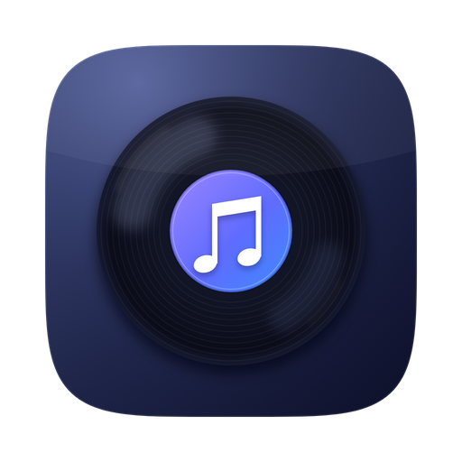
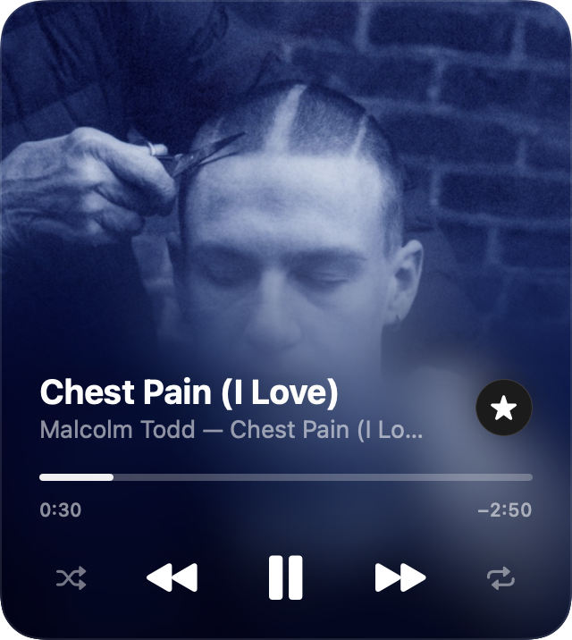
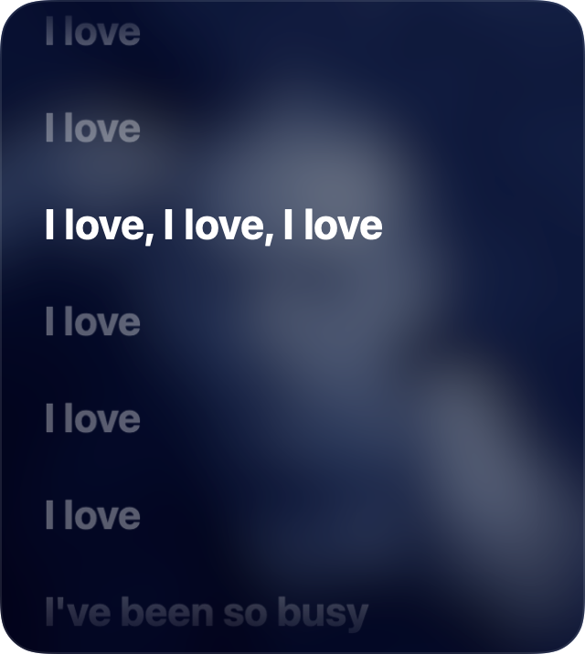
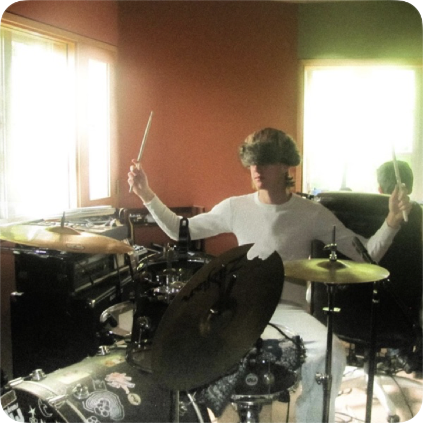
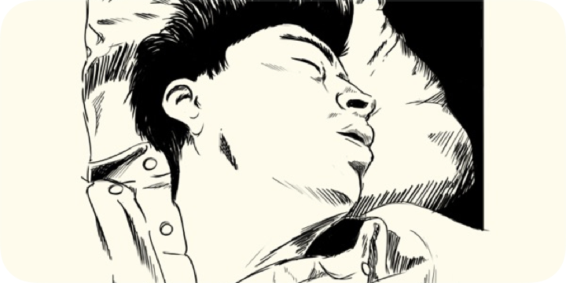
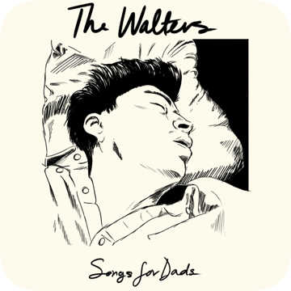

<p align="center">
  
</p>

<h1 align="center">Rota</h1>

<p align="center">
  A floating Apple&nbsp;Music widget for macOS — artwork-first, with synced lyrics.<br/>
  <em>rota</em> · Latin for "wheel"
</p>

<p align="center">
  
  
  
  
</p>

<p align="center">
  🌐 <a href="https://aalemoro.github.io/Rota/"><strong>aalemoro.github.io/Rota</strong></a>
</p>

---

<p align="center">
  
  &nbsp;&nbsp;
  
</p>

<p align="center">
  
  &nbsp;
  
  &nbsp;
  
</p>
<p align="center"><em>Three native sizes. At rest, every one of them is pure album art — controls fade in on hover.</em></p>

**Rota** puts a small, beautiful now-playing widget on your desktop. The album
cover fills the whole card, melting into frosted glass behind the controls —
and one click flips it into a karaoke-style **synced lyrics** view. It floats
above your windows (or below, your call), follows you across Spaces, and stays
out of the Dock.

## ✨ Features

- 🎨 **Artwork-first design** — the cover *is* the interface, with a progressive
  blur and scrim exactly like Apple Music's MiniPlayer. At rest it shows
  *only* the album art; every control fades in on hover.
- 🧩 **Gallery widget included** — a real WidgetKit widget (*Rota → Now
  Playing*) you add from right-click on the desktop → **Edit Widgets**, in
  three sizes with working transport buttons.
- 🎛 **Full transport** — play/pause, next/previous, a draggable seek bar with
  elapsed/remaining time, shuffle and repeat (off → all → one).
- 🎤 **Synced lyrics** — line-by-line highlighting that scrolls with the song,
  via the free [LRCLIB](https://lrclib.net) database. Click any line to jump
  there. Falls back to plain lyrics when no synced version exists.
- ⭐ **Favourite** the current song without touching the Music app.
- 🔊 **Volume** control tucked into the hover toolbar.
- 🖥 **A true desktop widget** — it sits just above your wallpaper, under your
  windows, exactly like macOS's own widgets. Hit 📌 to float it above
  everything instead. Visible on every Space either way.
- 🧊 **Static, like a real widget** — its position is locked by default so a
  stray drag never moves it. Relocate with **⌘-drag**, the menu, or
  `rota://move`.
- ⌨️ **Keyboard shortcuts** — click the widget, then:
  `space` play/pause · `←`/`→` previous/next · `↑`/`↓` volume · `L` lyrics ·
  `F` favourite · `esc` close lyrics / hide.
- 📐 **Three official widget sizes** — small, medium and large (the same
  footprints as macOS's own widgets), switched from the right-click menu.
  Drag the widget and it **snaps into the native widget grid**.
- 🖼 **Covers always load** — local artwork first; if a streaming track
  exposes none, Rota resolves it from Apple's catalogue automatically.
- 👻 **Alive even when Music is closed** — the widget keeps showing the last
  album cover; hover reveals a Resume button that reopens Music and picks up
  where you left off, in one click.
- 🫥 **Chrome-free, like a real widget** — no Dock icon, no menu bar item, no
  window buttons. Everything lives in the right-click menu; launch Rota
  again (Spotlight) to bring the widget back after hiding it.
- 🪶 **Native and tiny** — pure Swift + SwiftUI, zero third-party dependencies,
  no Electron, ~2 MB on disk.

## 📦 Install

> Rota controls the **Music app**, so it works with your Apple Music
> subscription *and* with a local library. Nothing to sign into.

### Option 1 — Download the app (easiest)

1. Grab **`Rota-x.y.z-macOS.zip`** from the
   [latest release](https://github.com/aalemoro/Rota/releases/latest).
2. Unzip it and drag **Rota.app** into **Applications**.
3. First launch: **right-click → Open** (the build is ad-hoc signed, so macOS
   asks once). Alternatively, clear the quarantine flag yourself:

   ```bash
   # Tells Gatekeeper you trust the app you just downloaded
   xattr -dr com.apple.quarantine /Applications/Rota.app
   ```

4. Click **Allow** when macOS asks if Rota may control Music. Done. 🎉

### Option 2 — Homebrew

```bash
# --no-quarantine spares the right-click → Open dance (the build is ad-hoc signed)
brew install --cask aalemoro/tap/rota --no-quarantine
```

### Option 3 — One command

Builds from source and installs into Applications automatically:

```bash
/bin/bash -c "$(curl -fsSL https://raw.githubusercontent.com/aalemoro/Rota/main/scripts/install.sh)"
```

### Option 4 — Build from source

Requires Apple's Command Line Tools (`xcode-select --install`). No Xcode
project, no signing setup — it's a plain Swift package:

```bash
# 1. Get the code
git clone https://github.com/aalemoro/Rota.git
cd Rota

# 2. Compile and assemble Rota.app into ./build
make app

# 3. Copy it into /Applications (falls back to ~/Applications)
make install

# — or just build & launch it in place:
make run
```

Other useful targets:

```bash
make zip     # package build/Rota-x.y.z-macOS.zip for distribution
make clean   # remove all build products
```

## 🕹 Using Rota

| You want to… | Do this |
|---|---|
| Change size | Right-click → **Widget Size** → Small / Medium / Large |
| Move the widget | Drag it — it snaps into the native widget grid (lock it from the menu; ⌘-drag still works when locked) |
| See the controls | Hover the widget — at rest it's pure album art |
| Lyrics mode | Hover → 💬 button, or press `L`, or right-click → *Show Lyrics* |
| Jump inside a song | Drag the seek bar, or click a lyrics line |
| Bring it above your windows | Hover → 📌 pin (click again to send it back to the desktop) |
| Hide / bring back | Right-click → *Hide Rota* (or `esc`) · open **Rota** from Spotlight to bring it back |
| Start at login | Right-click → *Start at Login* (on by default after first launch) |

### ⚡ Scripting (`rota://` URLs)

Rota answers to URL commands, so you can wire it into Raycast, Shortcuts,
aliases — anything that can `open` a URL:

```bash
open "rota://playpause"   # toggle playback        rota://next · rota://previous
open "rota://lyrics"      # open lyrics mode       rota://player closes it
open "rota://toggle"      # show / hide the widget rota://favorite ⭐ the song
open "rota://dump"        # write player state to /tmp/rota_state.json (JSON)
open "rota://snapshot"    # save a PNG of the widget to /tmp/rota_snapshot.png
open "rota://move?corner=topleft&margin=40"   # park it in a corner
open "rota://move?x=60&y=80"                  # or at exact coordinates
```

## 🔒 Privacy & permissions

- Rota needs **one** permission: *Automation → Music* (macOS asks on first
  launch). That's how it reads what's playing and presses play for you.
- Lyrics lookups send only **title, artist, album and duration** to
  [LRCLIB](https://lrclib.net) over HTTPS — no account, no keys, no tracking.
  Results are cached locally in `~/Library/Caches/Rota`.
- When a streaming track has no local artwork, Rota asks Apple's public
  **iTunes Search API** for the cover (artist + album only, HTTPS).
- Nothing else ever leaves your Mac. No analytics, no other network calls.

If you denied the permission by accident:
**System Settings → Privacy & Security → Automation → Rota → enable Music** —
or run:

```bash
# Resets the Automation permission so macOS asks again
tccutil reset AppleEvents io.github.aalemoro.rota
```

## 🛠 How it works

- **UI** — SwiftUI inside a borderless, non-activating `NSPanel` (that's why
  clicking the widget never steals focus from the app you're working in).
- **Playback bridge** — a compiled `NSAppleScript` bridge to the Music app:
  one round-trip per second returns the full player state, and distributed
  notifications (`com.apple.Music.playerInfo`) make track changes feel
  instant. The same battle-tested approach used by long-standing third-party
  mini players — no MusicKit authorization flows, no private APIs.
- **Lyrics** — `[mm:ss.xx]`-timestamped LRC parsing with a small scorer that
  matches the right edit of a song by duration, plus an on-disk cache.

```
Sources/Rota
├── main.swift              app entry
├── AppDelegate.swift       floating panel, menu bar, shortcuts
├── Player
│   ├── MusicBridge.swift   Apple Events bridge (state, commands, artwork)
│   └── PlayerStore.swift   observable state, polling, optimistic actions
├── Lyrics
│   └── Lyrics.swift        LRCLIB client, LRC parser, disk cache
└── Views
    ├── RootView.swift      shell, background, hover chrome, empty states
    ├── PlayerView.swift    title row, seek bar, transport controls
    └── LyricsView.swift    synced karaoke view / plain fallback
```

## 🩹 Troubleshooting

| Symptom | Fix |
|---|---|
| "Music isn't running" card | Click **Open Music** — Rota never launches Music behind your back |
| Controls do nothing | Grant the Automation permission (see above) |
| No lyrics for a song | LRCLIB simply may not have them — the words view falls back or tells you |
| "Rota can't be opened" on first launch | Right-click → **Open**, or the `xattr` command in the install section |
| Widget vanished | Open **Rota** from Spotlight / Launchpad — the widget pops right back |

## 🗺 Roadmap

- 📱 iOS companion widget (WidgetKit + App Intents)
- 🟢 Spotify as a second, auto-detected source
- 🖼 Notarized DMG releases
- 🏪 Mac App Store build (sandbox + scripting-targets entitlement)

## 📄 License

[MIT](LICENSE) © 2026 Alessandro Gaudio.
Album artwork belongs to its copyright holders. Lyrics data courtesy of
[LRCLIB](https://lrclib.net).
