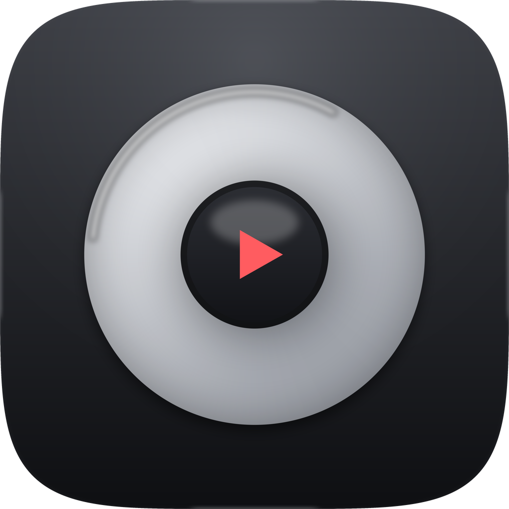
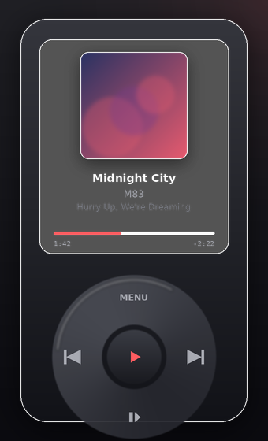
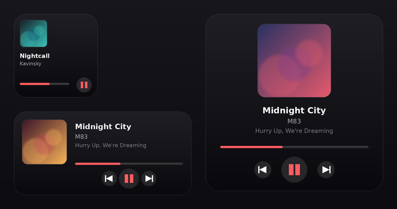

<div align="center">



# Rota

**Your Apple Music, on a wheel.** 🎧

A tiny iPod for your Mac — a Liquid Glass menu-bar player and a home-screen widget that lets you scrub, skip and play straight from the click wheel.

[](https://www.apple.com/macos/)
[](https://swift.org)
[](https://developer.apple.com/xcode/swiftui/)
[](https://developer.apple.com/musickit/)
[](LICENSE)



</div>

---

## ✨ What it is

Rota reimagines the classic iPod click wheel as a **Liquid Glass** control surface on macOS. It plays your Apple Music library through `MusicKit`, and mirrors what's playing into a **WidgetKit widget in three sizes** whose buttons actually control playback — no need to open the Music app.

- 🎡 **Real click wheel** — drag the ring to scroll your library or scrub the current track; tap the cardinal zones for Menu, ⏮, ⏭ and ⏯; press the center to select.
- 🧊 **Liquid Glass throughout** — built on the iOS/macOS 26 `glassEffect` APIs, so the wheel, screen and widget feel like frosted glass rather than flat rectangles.
- 🧩 **Interactive widget, three sizes** — Small, Medium and Large. Transport buttons are wired to App Intents, so a tap plays/pauses or skips instantly.
- 📊 **Menu-bar player** — the same iPod drops down from the status bar, so your music is one click away.
- 🍎 **Native Apple Music** — no scraping, no third-party accounts. Just `MusicKit` and your own library.

## 📸 The widget, in three sizes

<div align="center">

</div>

| Size | What you get |
| --- | --- |
| **Small** | Artwork, title/artist, progress, one play/pause button. |
| **Medium** | Artwork, full track info, progress, and ⏮ ⏯ ⏭ transport. |
| **Large** | Big artwork, full info, progress, and large transport controls. |

## 🧰 Requirements

| | |
| --- | --- |
| 🖥️ macOS | **26 (Tahoe)** or later — Liquid Glass ships with 26. |
| 🛠️ Xcode | **26** or later. |
| 🎵 Apple Music | An active subscription (needed to play library content). |
| 📦 XcodeGen | Generates the `.xcodeproj` from `project.yml` — `brew install xcodegen`. |
| 🍏 Apple Developer | A (free or paid) account for signing; **paid** to ship on the App Store. |

## 🚀 Getting started

```bash
# 1 — Clone
git clone https://github.com/<your-username>/Rota.git
cd Rota

# 2 — Install the project generator (once)
brew install xcodegen

# 3 — Generate the Xcode project from project.yml
xcodegen generate

# 4 — Open it
open Rota.xcodeproj
```

Then, **once**, wire up signing and the shared container in Xcode:

1. **Signing** — select the `Rota` and `RotaWidgetExtension` targets → *Signing & Capabilities* → pick your Team. Xcode will manage the certificates.
2. **App Group** — on *both* targets add an **App Group** and set it to `group.com.yourteam.rota`
   *(or rename it — just keep it identical in `Rota.entitlements`, `RotaWidget.entitlements` and `AppGroup.identifier` in `Shared/AppGroup.swift`).*
3. **Bundle IDs** — replace `com.yourteam.rota` / `com.yourteam.rota.widget` with your own reverse-domain identifiers (in `project.yml`, then re-run `xcodegen generate`).
4. **Run** ▶️ — build the `Rota` scheme. Grant Apple Music access when prompted, and your library loads onto the wheel.
5. **Add the widget** — right-click the desktop or open Notification Center → *Edit Widgets* → search **Rota** → drop in the size you like.

> 💡 **Tip:** the `.xcodeproj` is intentionally *git-ignored*. `project.yml` is the source of truth — regenerate any time with `xcodegen generate`. This keeps the repo clean and diff-friendly.

## 🗂️ Project structure

```
Rota/
├── project.yml                 # XcodeGen spec — the whole project in one file
├── Rota/                       # macOS app target
│   ├── RotaApp.swift           # @main — window + menu-bar scene
│   ├── Model/
│   │   └── MusicController.swift   # auth, library, playback, wheel navigation
│   ├── Views/
│   │   ├── iPodView.swift       # the glass body: screen + wheel
│   │   ├── ClickWheel.swift     # the interactive wheel (drag + tap zones)
│   │   ├── NowPlayingView.swift # artwork / title / progress
│   │   ├── LibraryView.swift    # the scrollable song list
│   │   └── GlassComponents.swift
│   ├── Shared/                  # compiled into BOTH app and widget
│   │   ├── AppGroup.swift        # shared identifiers
│   │   ├── SharedModel.swift     # NowPlayingSnapshot + store
│   │   ├── PlaybackEngine.swift  # async wrapper over ApplicationMusicPlayer
│   │   ├── Artworks.swift        # artwork → PNG helper
│   │   └── Theme.swift
│   └── Assets.xcassets/AppIcon.appiconset   # the generated app icon
├── RotaWidget/                 # widget extension target
│   ├── RotaWidgetBundle.swift
│   ├── RotaWidget.swift         # small / medium / large layouts
│   ├── Provider.swift           # timeline from the shared snapshot
│   └── PlaybackIntents.swift    # App Intents behind the buttons
└── design/                     # Python generators for the icon + mockups
```

## ⚙️ How it works

Rota keeps the app and the widget in sync through a small **shared snapshot**:

1. The app plays music via `ApplicationMusicPlayer.shared`, wrapped by **`PlaybackEngine`**.
2. After every change, the engine writes a compact `NowPlayingSnapshot` (title, artist, artwork thumbnail, progress…) into the **App Group** and calls `WidgetCenter.reloadTimelines`.
3. The widget's `TimelineProvider` reads that snapshot — so it always shows the real state.
4. Tapping a widget button runs an **App Intent** (`PlayPauseIntent`, `NextTrackIntent`, `PreviousTrackIntent`) that calls the *same* `PlaybackEngine`, then refreshes the snapshot again.

Because both sides go through one engine and one shared file, the wheel, the menu-bar player and the widget never disagree about what's playing. 🔁

## 🗺️ Roadmap

- [ ] Haptic-style feedback and sound on wheel steps
- [ ] Search screen (spin to a letter, iPod-style)
- [ ] Lock Screen / StandBy widget on iOS (the codebase is structured to port)
- [ ] Playlists and "Up Next" on the wheel
- [ ] AppKit `UIGlassEffect` polish pass for the wheel highlight

## 📤 Publishing to the App Store

1. In Xcode: *Product → Archive*, then *Distribute App → App Store Connect*.
2. In [App Store Connect](https://appstoreconnect.apple.com), create the app record, upload the build, and attach screenshots (the ones in `docs/` are a good starting point).
3. Fill in the **Apple Music** capability on your App ID and mention `MusicKit` usage in the review notes.
4. Submit for review. 🚀

> ⚠️ **Note:** you need a **paid** Apple Developer Program membership to publish. The app icon, entitlements and metadata are already set up for a smooth submission.

## 📝 License

Released under the [MIT License](LICENSE). Album artwork and Apple Music content belong to their respective owners; Rota only controls playback of music you already have access to.

---

<div align="center">
Made with 🖤 for people who miss the click wheel.
</div>
